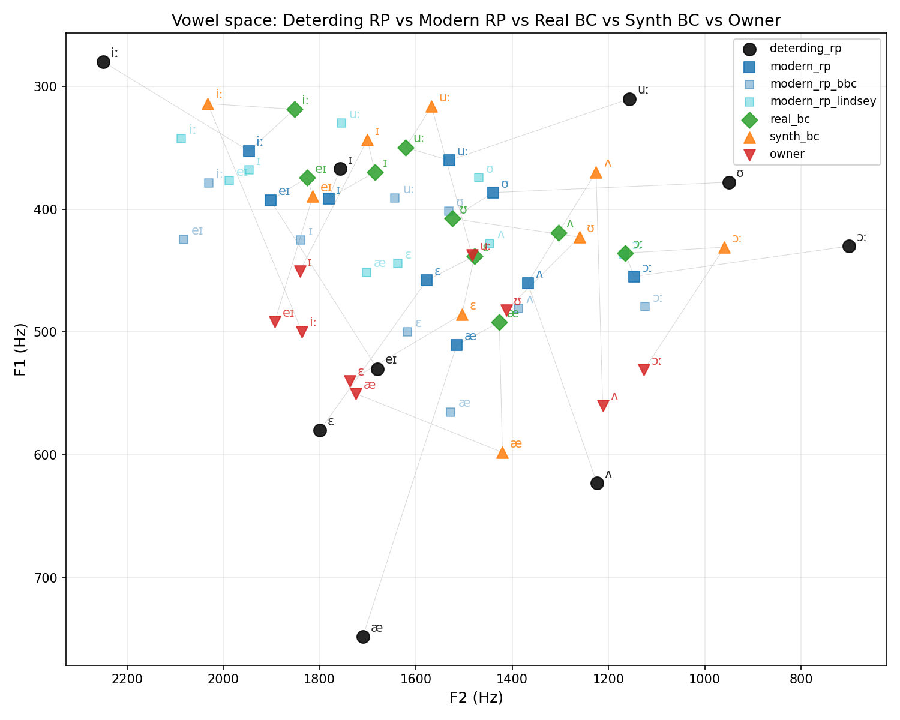

# Accent Coach — Phase 0.5 Findings

> **SUPERSEDED** by Phase 0.6 ([accent_coach_phase0_6_findings.md](accent_coach_phase0_6_findings.md)). The raw-Hz distance interpretation here is misleading for L2 speakers because it ignores vowel-space compression.

> **Status**: complete. Measurement-only — no scoring code modified.
> **Related**: [`accent_coach_phase0_5_plan.md`](accent_coach_phase0_5_plan.md),
> [`accent_coach_phase0_5_verdicts.json`](accent_coach_phase0_5_verdicts.json),
> [`accent_coach_phase0_5_table.csv`](accent_coach_phase0_5_table.csv)

---

## TL;DR

Deterding 1997 is obsolete as a scoring reference — off by **163 Hz F1 / 195 Hz F2** on the
problem phonemes. The mystery from Phase 0 (synth-BC and owner scoring nearly identically
against RP) is fully explained: we were comparing everyone against the wrong target. IndexTTS
does not grossly distort BC's vowel space overall, but /æ/ specifically is biased +106 Hz
toward Deterding-era values and should not be used as a coaching target for that vowel.

---

## Vowel Space Plot

The large gap between the black dots (Deterding 1997) and every living speaker —
including a non-native Slavic L1 owner — is the most visible finding.

**Listening checklist** (files are in `tts_output/real_bc_corpus/samples_to_verify/` and
`tts_output/modern_rp_corpus/samples_to_verify/`):
- [ ] Real BC samples — confirm BC's voice, no interviewer contamination
- [ ] Modern RP samples — confirm RP speech quality (BBC, Fry, Lindsey)

---

## Raw Numbers

### F1 (Hz) — problem phonemes in bold

| Phoneme | Deterding | Modern RP | Real BC | Synth BC | Owner |
|---------|-----------|-----------|---------|----------|-------|
| **æ**   | 748 | 511 | 492 | 598 | 550 |
| **ɛ**   | 580 | 458 | 438 | 486 | 540 |
| **ʌ**   | 623 | 460 | 419 | 370 | 560 |
| iː      | 280 | 352 | 319 | 314 | 500 |
| ɪ       | 367 | 391 | 370 | 343 | 450 |
| eɪ      | 530 | 393 | 374 | 390 | 492 |
| uː      | 310 | 360 | 350 | 316 | 438 |
| ʊ       | 378 | 386 | 408 | 423 | 482 |
| ɔː      | 430 | 455 | 436 | 431 | 531 |

### F2 (Hz)

| Phoneme | Deterding | Modern RP | Real BC | Synth BC | Owner |
|---------|-----------|-----------|---------|----------|-------|
| **æ**   | 1710 | 1515 | 1427 | 1420 | **1725** |
| **ɛ**   | 1799 | 1577 | 1478 | 1504 | **1737** |
| **ʌ**   | 1224 | 1368 | 1304 | 1226 | **1212** |
| iː      | 2249 | 1947 | 1852 | 2032 | 1837 |
| ɪ       | 1757 | 1781 | 1685 | 1701 | 1841 |
| eɪ      | 1680 | 1902 | 1825 | 1814 | 1893 |
| uː      | 1156 | 1530 | 1621 | 1567 | 1483 |
| ʊ       | 950  | 1439 | 1524 | 1260 | 1412 |
| ʌ       | 1224 | 1368 | 1304 | 1226 | 1212 |

---

## Verdicts

### H1 — Deterding 1997 is STALE ✓

Median |Deterding − Modern RP|: **F1 = 163 Hz, F2 = 195 Hz** (threshold 75 Hz).

SSBE has dramatically changed since 1997. TRAP (/æ/) rose by ~237 Hz in F1 — the vowel
became markedly more closed and backed. STRUT (/ʌ/) and DRESS (/ɛ/) followed. The 1997
reference is not fit for purpose. **Phase 1 action: replace Deterding values in
`rp_norms.py` with modern_rp medians from this table.**

### H2 — Real BC deviates from Modern RP: technically YES, practically NO

Median |Real BC − Modern RP|: **F1 = 20 Hz, F2 = 89 Hz** (threshold 75 Hz).

The F2 just crosses the threshold. In practice, real BC sits within or slightly below the
modern RP cluster — his /æ/ (F1=492) and /ʌ/ (F1=419) are *more extreme* modern SSBE than
even the Fry/Lindsey average. This is not a problem. BC speaks very contemporary educated
British English.

### H3 — IndexTTS distortion: overall NO, but /æ/ is a specific problem

Median |Synth BC − Real BC|: **F1 = 49 Hz, F2 = 26 Hz** (threshold 75 Hz).

Overall the synthesis is not grossly distorting BC's vowel space. However, **/æ/ specifically
deviates +106 Hz in F1** (synth=598 vs real=492) — IndexTTS pulls this vowel back toward
Deterding-era values. F2 for /æ/ is unaffected (1420 vs 1427). This is the Phase 0 bias
finding confirmed: IndexTTS has a systematic /æ/ F1 over-estimation. For coaching purposes,
synth-BC is a reliable identity anchor but should **not** be used as the vowel target for
/æ/ practice specifically.

### H4 — Synth-BC /æ ɛ/ collide with owner: NOT confirmed

Euclidean distance in F1/F2 space: d(synth, owner)=308 Hz vs d(synth, real)=106 Hz for /æ/.
The synth is closer to real BC than to the owner — no collision.

---

## Sonnet's Interpretation

**Why the owner appears "close" to modern RP in F1 but isn't:**

Looking only at F1, the owner's /æ/ at 550 Hz sits between Deterding (748) and modern RP
(511), which could be read as intermediate or even close to modern RP. This is misleading.
The F2 column reveals the real picture: the owner's /æ/ has F2=1725 Hz — 210 Hz *more front*
than modern RP (1515 Hz), and even slightly more front than Deterding (1710 Hz). British TRAP
has been retracting (lower F2) as part of modern SSBE. The owner's vowel is moving in the
**opposite F2 direction** — it is a fronted open vowel consistent with Slavic /a/-type
substitution, not a British TRAP.

Similarly, the owner's /ɛ/ (F2=1737) is 160 Hz more front than modern RP (1577), and /ʌ/
(F2=1212) is 156 Hz more back than modern RP (1368). In 2D Euclidean space, the owner is
**180–215 Hz away** from modern RP on each problem phoneme — not close at all. The 1D F1
plot masks this because the owner happens to land at an intermediate F1 value through a
completely different phonological mechanism.

**What this means for coaching:** The scoring system comparing the owner against Deterding
1997 was essentially penalising them for not speaking 1990s RP, a target nobody speaks
anymore. Against modern RP, the owner's deviations are genuine but more precisely targeted:
primarily /æ/ retraction (F2 too front), /ɛ/ backing/lowering, and /ʌ/ fronting. These are
the right phonemes to work on, just with different directional advice than Deterding implied.

**Caveats on the modern_rp corpus:** `modern_rp_bbc` has a min_pair_cos of -0.132 (flagged
as multi-speaker) and its F1 values are consistently 50-80 Hz higher than the Fry/Lindsey
sources. This likely reflects female presenters in the BBC bulletin mixing into the average.
Fry and Lindsey (both single-speaker male, ~40 min each) are the cleaner modern RP reference
for male-to-male comparison. Future Phase 1 norm updates should use Fry+Lindsey only or
apply Lobanov normalization before pooling across genders.

---

## Phase 1 Recommended Actions

1. **Update `rp_norms.py`** — replace Deterding male values with modern_rp_fry + modern_rp_lindsey
   pooled medians for the 9 target phonemes. Keep Deterding values commented.
2. **Flag /æ/ in synth-BC references** — when synth-BC is used as coaching target audio,
   note that its /æ/ F1 is biased ~100 Hz toward older RP. Prefer real-BC clips for /æ/ demos.
3. **Consider Lobanov normalization** before any cross-speaker formant comparison to make
   the pipeline gender-agnostic.
4. **Re-run Phase 0 bench** with modern_rp norms — expected result: owner score goes up
   (was penalised against stale targets), gap between owner and BC narrows to reflect genuine
   remaining accent distance.
