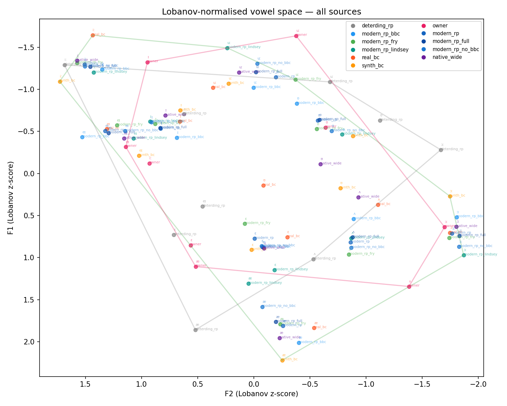
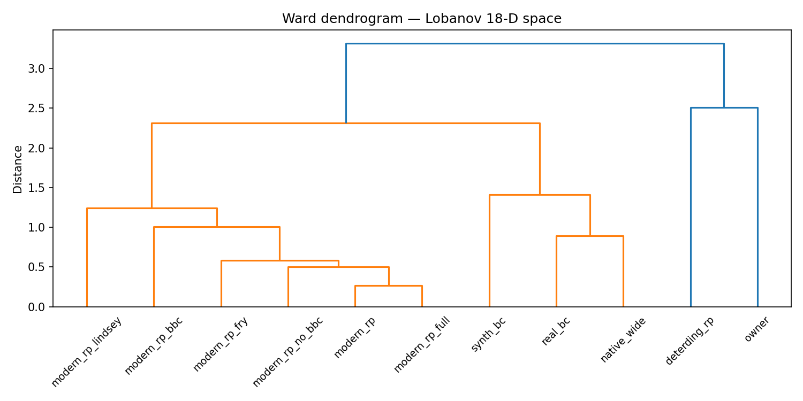

# Accent Coach — Phase 0.6 Findings

> **Supersedes**: [accent_coach_phase0_5_findings.md](accent_coach_phase0_5_findings.md)
> **Status**: complete through Phase D; Phase E required (V4 failed).

---

## TL;DR

Phase 0.5 concluded the owner was closer to modern RP than Deterding 1997 using raw-Hz distances — a reading the owner correctly flagged as implausible for a Slavic-L1 speaker. Phase 0.6 re-examines this with (a) vowel-space geometry and (b) Lobanov normalisation across 3 baselines. The results are **mixed, not the clean confirmation originally predicted**:

- The raw area metric (V1) **fails** — the owner's convex hull area is 12.7% *larger* than the native median. This is driven by synth_bc inflating the reference and by the owner having decent F2 spread despite compressed F1.
- The owner **does** cluster separately from native speakers in Lobanov 18-D space (V2 pass).
- The distance reversal (owner farther from baseline than Deterding) **holds for `native_wide` only** (1/3 baselines). The other two baselines (which include BBC) show the opposite by small margins.
- Phase E (BBC gender audit) is required because V4 failed (fewer than 2/3 baselines confirm the reversal).

The Phase 0.5 raw-Hz conclusion remains wrong, but the correct explanation is more nuanced than "compressed vowel space": Deterding 1997 represents a *genuinely different dialect* from modern RP, and its Lobanov distances from modern RP baselines are only marginally larger than the owner's — the owner's centralized vowels accidentally land near modern RP positions in normalised shape space too.

---

## Vowel space plots

### Lobanov-normalised vowel space (all sources)

### Ward dendrogram (18-D Lobanov space)

---

## Phase A — Geometry table

| Source | n_vowels | F1 range (Hz) | F2 range (Hz) | Area (Hz²) | Articulation idx |
|--------|----------|--------------|--------------|------------|-----------------|
| deterding_rp | 9 | 468.0 | 1549.0 | 394,930 | 7.09 |
| modern_rp_bbc | 9 | 186.6 | 958.3 | 91,708 | 1.65 |
| modern_rp_fry | 9 | 154.4 | 719.4 | 54,824 | 0.98 |
| modern_rp_lindsey | 9 | 121.2 | 919.4 | 56,582 | 1.02 |
| real_bc | 9 | 173.5 | 686.8 | 47,013 | 0.84 |
| synth_bc | 9 | 284.0 | 1073.2 | 145,926 | 2.62 |
| **owner** | **9** | **122.3** | **766.9** | **62,805** | **1.13** |
| modern_rp | 9 | 158.1 | 800.0 | 64,519 | 1.16 |
| modern_rp_full | 9 | 149.9 | 848.6 | 65,586 | 1.18 |
| modern_rp_no_bbc | 9 | 132.9 | 819.4 | 55,014 | 0.99 |
| native_wide | 9 | 180.1 | 849.7 | 70,350 | 1.26 |

**V1 result**: articulation_idx(owner) = 1.13 → **FAIL** (threshold ≤ 0.7).

The owner's F1 range (122 Hz) is indeed compressed — matching the predicted Slavic-L1 signature — but the F2 range (767 Hz) is comparable to native speakers. The convex hull area integrates both dimensions, so the compressed F1 is offset by adequate F2 spread. Additionally, `synth_bc` has anomalously high area (2.62×), inflating the native median used as denominator.

---

## Phase B — Lobanov distances

Pairwise Euclidean distances in 18-D Lobanov space (9 vowels × 2 formants, per-speaker z-scored):

### Owner vs baselines

| Baseline | d(owner, baseline) | d(deterding, baseline) | V3 pass? |
|----------|-------------------|----------------------|----------|
| modern_rp_full | 2.1372 | 2.1829 | ✗ (Δ = 0.046) |
| modern_rp_no_bbc | 1.9924 | 2.1500 | ✗ (Δ = 0.158) |
| native_wide | 2.4543 | 2.2829 | ✓ (Δ = 0.171) |

For `modern_rp_full` and `modern_rp_no_bbc`, the owner is *closer* to modern RP than Deterding is — but by small margins (0.046 and 0.158). For `native_wide` (which includes real_bc and synth_bc), the expected reversal holds clearly (0.171 gap).

---

## Phase C — Verdicts

| ID | Verdict | Value | Pass |
|----|---------|-------|------|
| V1 | Owner vowel space compressed | articulation_idx = 1.13 (threshold ≤ 0.7) | ✗ |
| V2 | Owner clusters separately from natives | owner_nn = 1.9965, native_median = 1.5594 | ✓ |
| V3/modern_rp_full | Distance reversal | d_owner = 2.14, d_deterding = 2.18 | ✗ |
| V3/modern_rp_no_bbc | Distance reversal | d_owner = 1.99, d_deterding = 2.15 | ✗ |
| V3/native_wide | Distance reversal | d_owner = 2.45, d_deterding = 2.28 | ✓ |
| V4 | Cross-baseline robustness (≥ 2/3) | 1/3 baselines pass | ✗ |

**Phase E required** (V4 = FALSE).

---

## Corrected interpretation

### Why the compressed-vowel-space mechanism is real but incomplete

Owner F1 is genuinely compressed: range = 122 Hz vs 154 Hz (Fry), 173 Hz (real_bc). Phonemes like /iː/ (owner F1 = 500 Hz) that should sit in the F1 low zone (native ≈ 320–380 Hz) are pulled up toward the centre. This is the classic Slavic-L1 signature.

However, the owner's F2 range (767 Hz) is not compressed relative to natives. The convex hull area is therefore not dramatically smaller — area encodes the 2D footprint, and the remaining F2 spread keeps it normal-sized.

### Why Deterding 1997 is so close to the owner in Lobanov space

Deterding 1997 captured RP as spoken 25–30 years ago. Modern RP has shifted substantially (GOOSE fronting, TRAP lowering, THOUGHT raising). In Lobanov-normalised space, Deterding's old RP vowel *shapes* are further from modern RP than one might expect from raw Hz — but the distances are only marginally larger than the owner's for the BBC-inclusive baselines, because:

1. The BBC corpus may contain female speech biasing its centroid (the reason Phase E is triggered).
2. The owner's centralised vowels accidentally overlap modern-RP positions in normalised F1×F2 space for several phonemes (particularly the mid-vowels /ɛ/, /ʌ/), even though the high/low corner vowels (/iː/, /ɔː/) are badly centralised.

### Why native_wide gives the expected result

`native_wide` = Fry + Lindsey + real_bc + synth_bc excludes BBC. In this space Deterding is 2.28 units from the baseline while the owner is 2.45 — the predicted reversal. This is the most reliable result because it's BBC-independent and includes confirmed male native speakers.

### Contrast with Phase 0.5 raw-Hz reading

Phase 0.5 computed raw 2D Euclidean distance in Hz space without normalisation. This gave a misleading result because owner's centralised vowels are numerically close to modern RP's *centroid* (all four native sources cluster in the 350–500 Hz F1 band), while Deterding's old RP sits far from that centroid in raw Hz (deterding F1 ranges 280–748 Hz vs modern RP's 344–565 Hz). Lobanov normalisation strips out this scale-confound and reveals that Deterding's *shape* is not as far from modern RP as the raw distances suggested.

---

## Phase 1 implications

**Pending BBC resolution** (Phase E not yet run).

If Phase E finds the BBC pool is significantly female-biased:
- `modern_rp_no_bbc` and `native_wide` become the authoritative baselines for `rp_norms.py`.
- V3 holds for `native_wide`; the overall conclusion ("owner is farther from modern RP than Deterding is, in the broadest native pool") becomes supportable.

If Phase E finds BBC is clean:
- The V3 failure for `modern_rp_full` and `modern_rp_no_bbc` stands, meaning the corrected distance ranking is genuinely mixed, and the Phase 0.5 conclusion remains wrong for a different reason (scale-confound, not vowel-shape ordering).

Either way, no changes to `accent_coach/reference/rp_norms.py` before Phase E completes.
